# Budget Buddy

Budget Buddy is a Python command line interface (CLI) application designed to help users manage their finances. Users can input their expenses and choose from a variety of views to break down their spending habits.

The program automatically syncs all inputs to a Google Sheet to ensure storage of and access to the expense details even outside of Budget Buddy.

Visit the deployed application [here](https://budget-buddy-expense-tracker-f207bb189dc1.herokuapp.com/).

## Table of Contents
1. [User Experience (UX)](#user-experience-ux)
    1. [Project Goals](#project-goals)
    2. [User Stories](#user-stories)
    3. [Design Choices](#design-choices)
    4. [Data Model](#data-model)
    5. [Flowchart](#flowchart)
2. [Features](#features)
    1. [Program Start and Main Menu](#program-start-and-main-menu)
    2. [Add Expenses](#add-expenses)
    3. [View Expenses](#view-expenses)
    4. [Input Validation](#input-validation)
    5. [Future Features](#future-features)
3. [Technologies Used](#technologies-used)
    1. [Languages](#languages)
    2. [Frameworks, Libraries and Packages](#frameworks-libraries-and-packages)
4. [Testing](#testing)
    1. [Testing User Stories](#testing-user-stories)
    2. [Validation](#validation)
    3. [Feature Testing](#feature-testing)
    4. [Device and Browser Testing](#device-and-browser-testing)
    5. [Bugs](#bugs)
    6. [Accessibility](#accessibility)
5. [Deployment](#deployment)
    1. [Connecting Google Sheets](#connecting-google-sheets)
    2. [Heroku](#heroku)
6. [Credits](#credit)
    1. [Content](#content)
    2. [Media](#media)
    3. [Code](#code)
7. [Acknowledgements](#acknowledgements)

## User Experience (UX)

### Project Goals

- The program should be easy to use.
- The program should provide users with feedback about their input.
- The program should allow users to add new expenses.
- The program should allow users to view existing expenses.
- The program should validate all user inputs.

### User Stories

- As a user, I want to be able to track and categorize my expenses.
- As a user, I want to be able to store my expense details in a Google Sheet for further processing.
- As a user, I want to be able to view my expenses in a convenient format.
- As a user, I want to be sure that my expense details are valid.
- As a user, I want the program to be pleasant and engaging.
- As a user, I want to receive feedback on my input.
- As a user, I want to understand the purpose of the program.

### Design Choices

#### Color Scheme

Since this program is purely focussed on back-end programming, no additional styling or formatting was applied to the page that contains the terminal.

[Colorama](https://pypi.org/project/colorama/) was used to apply color to the terminal text to enhance the user experience.

The following colors were used:

- Error messages display in red.

- A successful feedback message about updating the Google Sheet displays in green.

- Menu headers and the program logo display in cyan.

All colors are displayed in the *normal* style on a *normal* background.

 Colorama Palette 

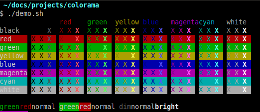

#### Banners and Logo

In order to improve the user's experience and enhance the visual appeal of the program, ASCII art was used to create a logo and header elements:

- [Many Tools](https://manytools.org/hacker-tools/ascii-banner/) was used to create the logo that displays when the program starts.

- [Emojicombos](https://emojicombos.com/deco-ascii-art) was used to create decorative menu headers.

#### Expense Display

To allow users to easily review and compare their potentially large number of expenses, these are displayed in a variety of tables, depending on the option the user selects.

[Tabulate](https://pypi.org/project/tabulate/) was used to create the tables used to display the expense details.

### Data Model

All user inputs are stored in a [Google Sheet](https://www.google.com/sheets/about/).

 Google Sheet 

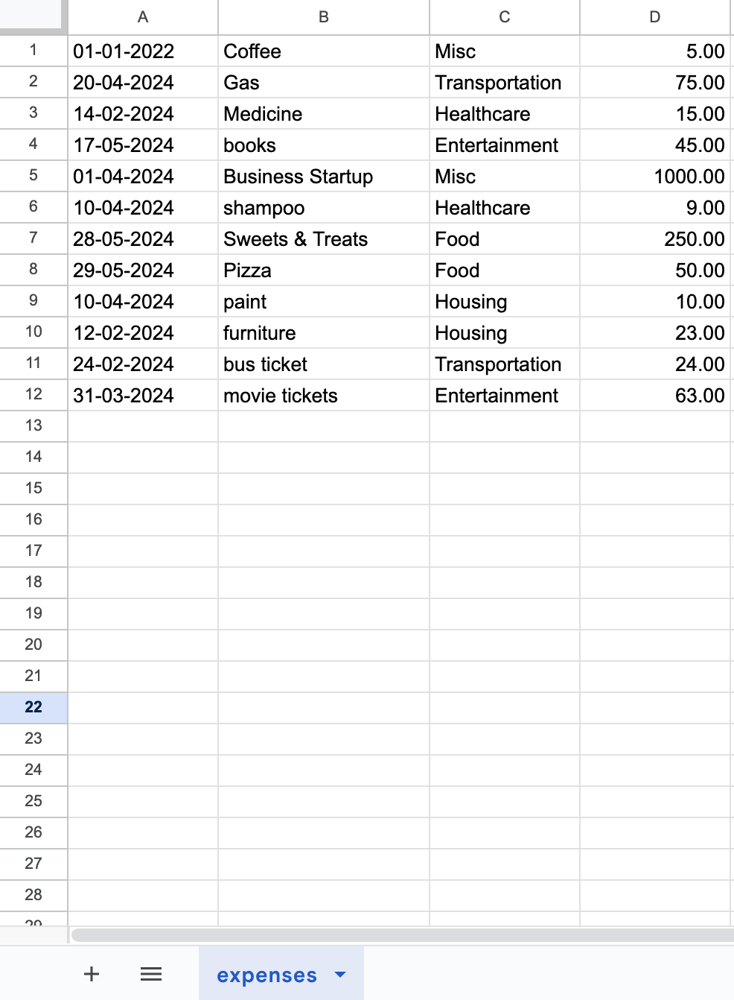

### Flowchart

During the initial planning phase, [Lucidchart](https://www.lucidchart.com/) was used to create a flowchart for the program to ensure a clear path for the user when navigating the menu.

 Flowchart 

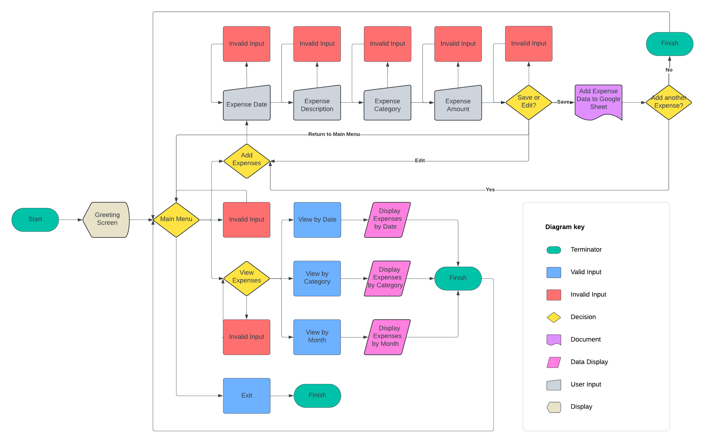

 

[Back to top ⇧](#budget-buddy)

## Features

### General

- A loading screen message provides users with feedback when switching between menus or accessing the Google Sheet.
- A typing effect was added to input requests, error messages, and menu overviews (but not the individual menu items) to simulate human interaction and enhance engagement and readability.
- When switching between menus or between expense views, the screen is cleared to provice users with a cleaner display and improve readability and focus.
- A menu header at the top of the terminal provides the user with guidance on which menu they are currently in.

### Program Start and Main Menu

- After the opening screen of Budget Buddy's ASCII art banner, the main menu is loaded. From here, users can choose between adding new expenses or viewing existing expenses. Users may also choose to exit the program from the main screen.
- A colorful banner at the top provides users with guidance on where they are. 

Logo

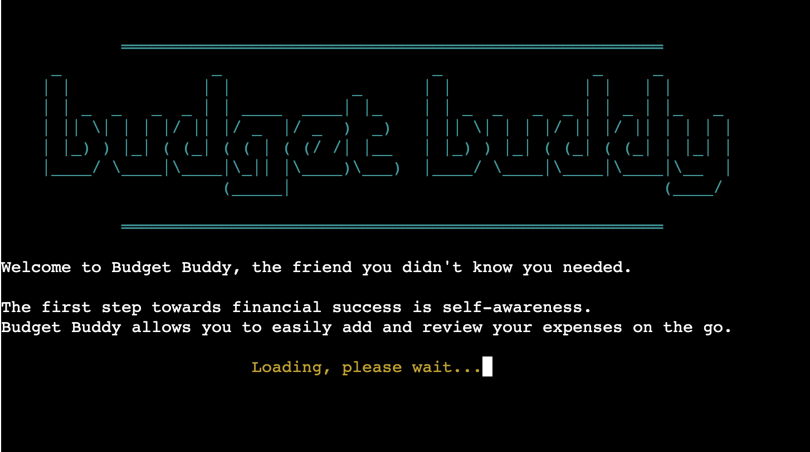

Main Menu

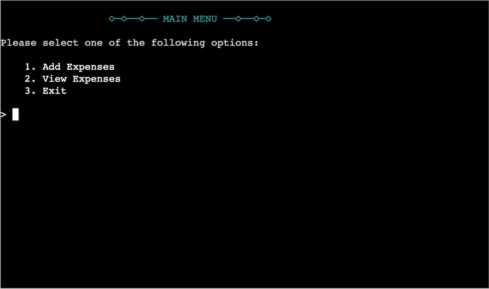

  

### Add Expenses

- The program collects various details from the user for each new expense, namely date, description, category, and amount.
- Each detail is collected using a new prompt and validated before users can proceed to the next detail.
-  Error messages inform users of incorrect inputs.
- After all details have been completed, users are shown a summary of their expense details. 
- Users can chose to confirm their inputs, saving them to the Google Sheet, or to re-enter them if they need to make any changes.
- After an expense has been added, users can choose to add another expense, which will re-start the process from the first step, or to return to the main menu.

Add Expense Details

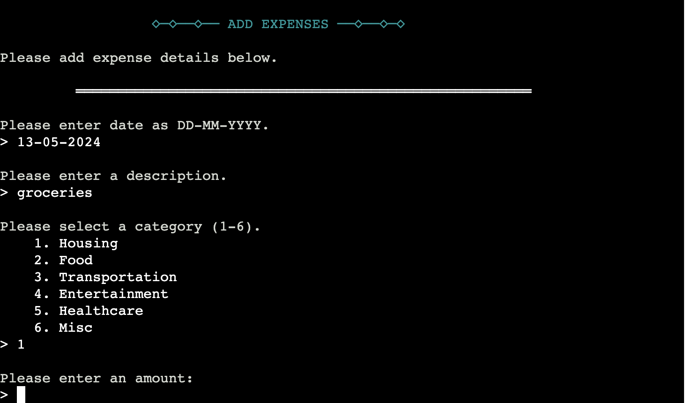

  

Confirm Expense Details

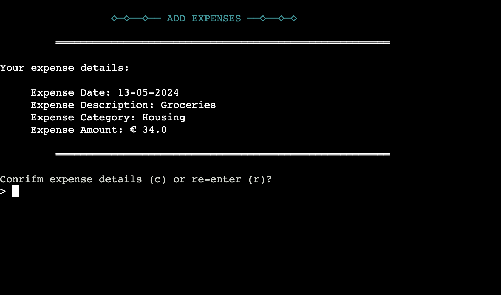

  

### View Expenses

- The program offers several viewing methods: by date, by category, and by month.
- Expenses are displayed in tabulated form for ease of readability and comparison.
- Users can switch between different viewing modes and also return to the main menu from any view.
- Each viewing mode includes a total of all expenses at the bottom.

View Expenses Menu

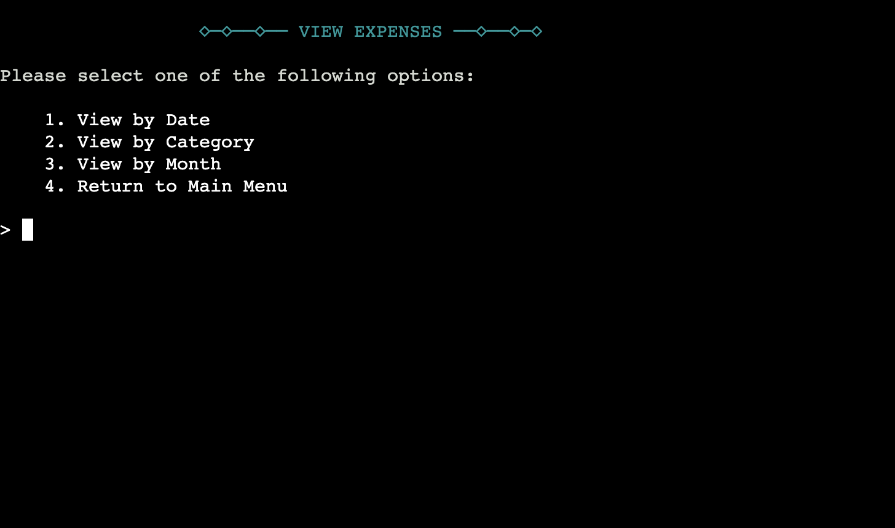

  

#### View by Date

- In this view, all expenses are organized by date, from oldest to newest.
- The order of the columns reflects the order of the expense details users enter in the *Add Expenses* menu to maintain coherence.

Date View

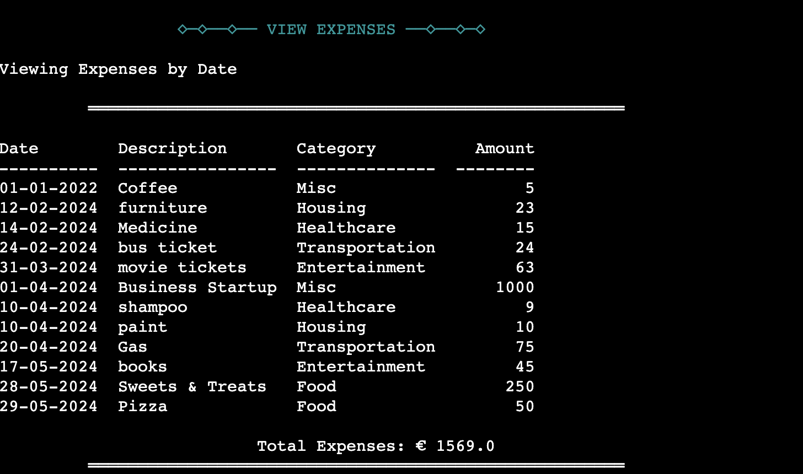

  

#### View by Category

- In this view, all expenses are displayed by category.
- The order of the categories reflects the order in which the categories were displayed in the *Add Expenses* menu to maintain coherence.

Category View

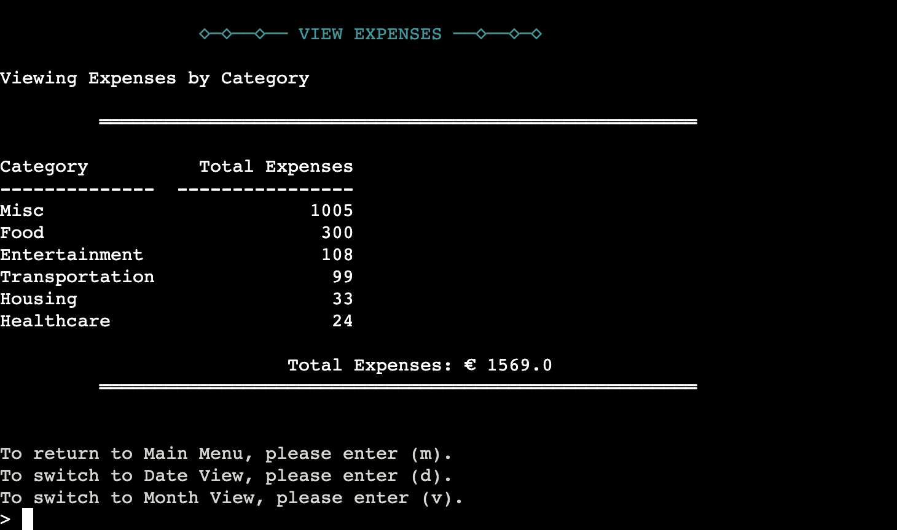

  

#### View by Month

- In this view, all expenses are displayed by month and category.
- The months are marked in the left-most vertical column and are displayed in chronological order.
- The categories are marked along the header row and are displayed in the same order as they were in the *Add Expenses* menu to maintain coherence.
- A total row was added as the right-most vertical row to show totals per category per month.
- Abbrviated versions of the category names were used in the header row to allow for for easier reading and to fit within the confines of a compact table layout

Month View

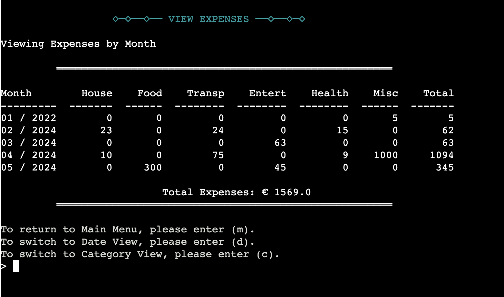

  

### Input Validation

- Input validation is performed every time users provide input.
- Before each input, users are given information on what kind of input is needed.
- In case of invalid input, an error message is printed in red, and users are reminded of what input types are accepted.
- After that, users will be able to provide input again.
- This loop will repeat until the program receives valid input.
- Where single letter inputs are required, both uppercase and lowecase letters will be accepted.
- Inputs cannot be empty.
- Dates are limited from 01-01-2024 to today and must be in DD-MM-YYYY format.
- Amounts have to be entered as numbers.

Input Validation

  

### Future Features

#### Category Totals for Month View

- A *total* column is provided at the end of the *Month View* to allow users to easily compare their total expenses by month.
- Adding a *total* row that displays the total expenses per category to date below the last month will provide additional insights into their spending habits to users.

#### Income Functionality

- To gain a more complete insight into their financial situation and allow for better planning, users will be able to add and view income details in addition to expense details.
- This would add a display of the remaining budget in each expense view, allowing users to plan their spending accordingly.
- Color coding could be added to provide feedback on over- or underspending.

#### Personalization

- In a new menu, users will be asked to define their own income and expense categories, rather than pick from a predefined list.
- Users will be able to set monthly and / or category budgets.

#### GUI

- Frameworks such as Tkinter and PyQt can be used to build graphical user interfaces for Python.
- A GUI would allow for a more user-friendly and visually appealing display of the program, improving the user experience.

#### Google Sheets Functionality

- Currently, Google Sheets is only used to store the expense details.
- By adding simple functionality such as charts and tables to the sheet, users would be able to view their expense details in a more appealing and accessible format.
- Google Sheets even allows for the possibility of interactive financial dashboards which would provide users with an engaging, easy to understand overview of their finances, based on their inputs into the expense and input tracker.

[Back to top ⇧](#budget-buddy)

## Technologies Used

### Languages

- [Python3](https://en.wikipedia.org/wiki/Python_(programming_language))

Provided as part of Code Institute's [Python Essentials template](https://github.com/Code-Institute-Org/python-essentials-template): 
- [HTML5](https://en.wikipedia.org/wiki/HTML5)
- [Javascript](https://en.wikipedia.org/wiki/JavaScript)

### Frameworks, Libraries, and Packages

- [Colorama](https://pypi.org/project/colorama/) was used to add colour to the terminal.

- [Datetime](https://docs.python.org/3/library/datetime.html) was used to validate date inputs.

-[Defaultdict](https://docs.python.org/3/library/collections.html#collections.defaultdict) was used to create a dictionary for expense categories and their corresponding totals.

- [Emojicombos](https://emojicombos.com/deco-ascii-art) was used to create decorative menu headers.

- [GitHub](https://github.com/) was used to store the project and for version control.

- [GitPod](https://gitpod.io/) was used for writing code, committing, and then pushing to GitHub.

- [GSpread](https://docs.gspread.org/en/v6.0.0/) was used to interact with the data in the linked sheet.

- [Google OAuth](https://google-auth.readthedocs.io/en/master/reference/google.oauth2.service_account.html) was used to authenticate the program in order to access Google's APIs.

- [Google Cloud](https://cloud.google.com/) was used to generate the APIs required to connect the data sheets with the Python code.

- [Google Sheets](https://docs.google.com/spreadsheets/) was used to store user input data.

- [Heroku](https://dashboard.heroku.com/login) was used to host and deploy the finished project.

- [Lighthouse](https://developer.chrome.com/docs/lighthouse/overview) was used to measure the quality of the page.

- [Lucidchart](https://www.lucidchart.com/pages/) was used to create the flowchart during project planning.

- [Many Tools](https://manytools.org/hacker-tools/ascii-banner/) was used to create a logo for the program.

- [Os](https://docs.python.org/3/library/os.html) was used to clear the screen when switching between menus or views. 

- [PEP8 online check](http://pep8online.com/) was used to validate the Python code.

- [Sys](https://docs.python.org/3/library/sys.html) was used to create the typing effect on certain text outputs.

- [Tabulate](https://pypi.org/project/tabulate/) was used to display the expense data in tables. 

- [Time](https://docs.python.org/3/library/time.html) was used to create delays in the program when switching between menus or performing operations. 

[Back to top ⇧](#budget-buddy)

## Testing

### Testing User Stories

As a user, I want to be able to track and categorize my expenses.
- Budget Buddy allows users to track their expenses.
- Budget Buddy prompts users to provide several details about an expense to categorize it accordingly.
- Budget buddy allows users to choose from a predefined list of categories for their expenses to help maintain consistency across entries.

As a user, I want to be able to store my expense details in a Google Sheet for further processing.
- Budget Buddy is set up to store all user inputs in a Google Sheet.
- Further processing of the data was beyond the scope of this project, but could easily implemented in the future.

As a user, I want to be able to view my expenses in a convenient format.
- Budget Buddy offers three different options for users to view their expenses.
- Expenses can be viewed by date, from the earliest to the latest date that was entered.
- Expenses can be viewed by category, providing a breakdown of all expenses according to their category.
- Expenses can be viewed by month and across categories. This is the most comprehensive view, allowing users to compare each month's total as well as individual categories.
- Each view also lists the total expenses at the bottom.
- Users are able to easily switch between views without having to return to the menu.

As a user, I want to be sure that my expense details are valid.
- Budget Buddy provides input validation for each step of the process.
- Error messages are printed in red to provide visual feedback as well as hints on how to complete the required input.
- After entering an expense, users have the option to review and confirm the details or re-enter them if a mistake was made.

As a user, I want the program to be pleasant and engaging.
- ASCII art is used to create an aesthetic interface and imrpve the user experience.
- Menus are kept concise and similar across different menus to improve readability and provide consistency.
- With the exception of the expense views, especiall when a lot of data is being reviewed, no scrolling is necessary to engage with the program.
- The screen is cleared when navigating between menus or views to provide a clear distinction and improve readability.
- When switching screens, a short delay is implemented to allow users to transition between tasks or views.
- Typing effects are used to create the illusion of a dynamic interaction. 
- Input prompts use simple language and are kept concise to avoid confusion.

As a user, I want to receive feedback on my input.
- All user inputs are validated.
- Budget Buddy provides users with feedback for incorrect inputs and prompts again until valid inpits are received.
- Error messages are printed in red to draw attention.
- After saving an expense to the linked Google Sheet, a success message is printed in green.
- Each error message contains information on how to provide valid input.
- Loading messages provide users with feedback of what is happening, such as what process is running in the background or which menu is being loaded.
- Menu banners across the top of the terminal provide the user with guidance on which menu they are currently in.

As a user, I want to understand the purpose of the program.
- Budget Buddy starts with a title screen that displays the name and logo.
- The purpose of the program is stated in the main menu.

### Validation

#### Code Validation
The code was validated using [Pep8 Linter](https://pep8ci.herokuapp.com/#). No errors were found in its final testing.

 Pep8 Linter Validation 

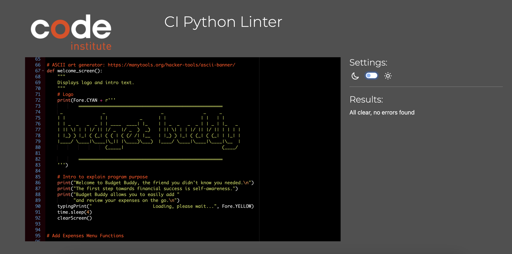

  
Note: No validation was performed on the *.html* and *.js* files that were provided as part of Code Institute's [Python Essentials template](https://github.com/Code-Institute-Org/python-essentials-template).

#### User Input Validation

User input validation was carried out throughout the project.   

| Feature | Tested? | User Feedback Provided |
|---|---|---|
| Main Menu | Yes | Invalid input: Please select one of the options (1-3). |
| View Expenses Menu | Yes | Invalid input: Please select one of the options (1-4). |
| View Expenses by Date | Yes | Invalid input: Please enter (m) to return to Main Menu or (c) to switch to Category View or (v) to switch to Month View. |
| View Expenses by Category | Yes | Invalid input: Please enter (m) to return to Main Menu or (d) to switch to Date View or (v) to switch to Month View. |
| View Expenses by Month | Yes | Invalid input: Please enter (m) to return to Main Menu or (d) to switch to Date View or (c) to switch to Category nth View. |
| Add Expenses Date | Yes | Invalid input: Please enter date as DD-MM-YYYY. |
| Add Expenses Date | Yes | Invalid input: Date must be between 01-01-2024 and today. |
| Add Expenses Description | Yes | Invalid input: Description cannot be empty. |
| Add Expenses Category | Yes | Invalid input: Please select one of the options (1-6). |
| Add Expenses Amount | Yes | Invalid input: Please enter a number. |
| Confirm Expense Details | Yes | Invalid input: Please enter (c) to confirm or (r) to re-enter details. |
| Add another Expense | Yes | Invalid input: Please enter (a) to add another expense or (m) to return to Main Menu. |

### Feature Testing

<table>
    <tr>
        <th>Feature</th>
        <th>Outcome</th>
        <th>Example</th>
        <th>Pass/Fail</th>
    </tr>
    <tr>
        <td>Logo</td>
        <td>When the program starts, a logo is displayed for a few seconds before the main menu loads.</td>
        <td></td>
        <td>Pass</td>
    </tr>
    <tr>
        <td rowspan=3>Main Menu</td>
        <td>Select Add Expenses</td>
        <td></td>
        <td>Pass</td>
    </tr>
        <td>Select View Expenses</td>
        <td></td>
        <td>Pass</td>
    </tr>
    <tr>
        <td>Select Exit</td>
        <td></td>
        <td>Pass</td>
    </tr>
    <tr>
        <td rowspan=2>Expense Date</td>
        <td>Validate date input</td>
        <td></td>
        <td>Pass</td>
    </tr>
    <tr>
        <td>Date input outside date range </td>
        <td></td>
        <td>Pass</td>
    </tr>
    <tr>
        <td>Expense Description</td>
        <td>Validate description input</td>
        <td></td>
        <td>Pass</td>
    </tr>
    <tr>
        <td>Expense Category</td>
        <td>Validate category input</td>
        <td></td>
        <td>Pass</td>
    </tr>
        <tr>
        <td>Expense Amount</td>
        <td>Validate amount input</td>
        <td></td>
        <td>Pass</td>
    </tr>
    <tr>
        <td rowspan=3>Confirm Input</td>
        <td>Update Google Sheet</td>
        <td></td>
        <td>Pass</td>
    </tr>
    <tr>
        <td>Re-enter expense details </td>
        <td></td>
        <td>Pass</td>
    </tr>
    <tr>
        <td>Validate user input </td>
        <td></td>
        <td>Pass</td>
    </tr>
     <tr>
        <td rowspan=3>Add additional Expenses</td>
        <td>Add additional expenses</td>
        <td></td>
        <td>Pass</td>
    </tr>
        <td>Return to main menu</td>
        <td></td>
        <td>Pass</td>
    </tr>
    <tr>
        <td>Validate user input</td>
        <td></td>
        <td>Pass</td>
    </tr>
    <tr>
        <td rowspan=5>View Expenses Menu</td>
        <td>View by date</td>
        <td></td>
        <td>Pass</td>
    </tr>
        <td>View by category</td>
        <td></td>
        <td>Pass</td>
    </tr>
    <tr>
        <td>View by month</td>
        <td></td>
        <td>Pass</td>
    </tr>
        <tr>
        <td>Return to main menu</td>
        <td></td>
        <td>Pass</td>
    </tr>
    <tr>
        <td>Validate user input</td>
        <td></td>
        <td>Pass</td>
    </tr>
    <tr>
        <td>Date View</td>
        <td>View by date</td>
        <td></td>
        <td>Pass</td>
    </tr>
        <tr>
        <td>Category View</td>
        <td>View by category</td>
        <td></td>
        <td>Pass</td>
    </tr>
        <tr>
        <td>Month View</td>
        <td>View by month</td>
        <td></td>
        <td>Pass</td>
    </tr>
        <tr>
        <td rowspan=3>Switch View</td>
        <td>Switch between expense views</td>
        <td></td>
        <td>Pass</td>
    </tr>
    <tr>
        <td>Return to main menu</td>
        <td></td>
        <td>Pass</td>
    <tr>
        <td>Validate user input</td>
        <td></td>
        <td>Pass</td>
    <tr> 
</table>

### Device and Browser Testing

#### Browser Compatibility
Browser | Outcome | Pass/Fail
--- | --- | ---
Google Chrome | No issues with appearance or functionality. | Pass
Safari | Issues with appearance or functionality. | Fail
Mozilla Firefox | No issues with appearance or functionality. | Pass
Microsoft Edge | No issues with appearance or functionality. | Pass

Note: The program starts on Safari but no user input is recognized. This seems to be a known issue of Code Institute's [Python Essentials template](https://github.com/Code-Institute-Org/python-essentials-template). 

#### Device Compatibility
Device | Outcome | Pass/Fail
--- | --- | ---
MacBook Pro 13" | No issues with appearance or functionality. | Pass
Acer Predator Helios 300 | No issues with appearance or functionality. | Pass

Note: No further device testing was performed since assuring responsivenes  of  Code Institute's [Python Essentials template](https://github.com/Code-Institute-Org/python-essentials-template) was beyond the scope of this project.

### Bugs

|Feature | Bug | Fix |
|---|---|---|
| Typing Effect | Typing effects displaying incorrectly when combined with Colorama | Updated typingPrint function to combine (color + character) and declared default color (color=Fore.WHITE) |

After rigorous testing, there are no known bugs in the code.

### Accessibility

[Lighthouse](https://developer.chrome.com/docs/lighthouse/overview) in [Chrome DevTools](https://developer.chrome.com/docs/devtools/) was used to measure the quality of the page, focussing on performance, accessibility, best practices, and SEO scores.

Lighthouse Report

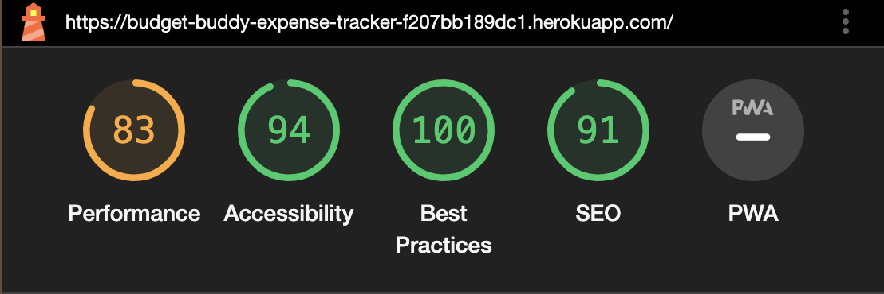

 

[Back to top ⇧](#budget-buddy)

## Deployment

The program was developed using [GitPod](https://www.gitpod.io/), which was then committed and pushed to [GitHub](https://github.com/) using the GitPod terminal.
The finished project was deployed in [Heroku](https://dashboard.heroku.com/login) using the Code Institute Python Terminal for display purposes. 

### Connecting Google Sheets

- This project required the use of Google Drive API and Google Sheets API, both enabled via [Google Cloud Platform](https://cloud.google.com).
- A credentials file was generated through the Google Drive API and added to the workspace.
- To ensure that the sensitive information contained in the credentials would not be pushed to the repository, the credentials file was added to *gitignore*.
- The client_email address contained within the credentials file was added to the Google Sheet as an editor to enable access.
- Variables and scope to access the worksheet were defined at the top of the *run.py* file.
- Using the terminal, GSpread and OAuth packages were installed.

### Heroku

Deployment to Heroku was completed using the following steps:

1. Update your *requirements.txt* file
    - Run pip3 freeze > requirements.txt' in the terminal to add a list of dependencies to *requirements.txt*.
    - Commit and push the changes to Github.
2. Log in to Heroku and from the dashboard, click *Create New App*.
    - Enter an app name and choose your region.
    Click *Create App*.
3. Go to *Settings* and update the *ConfigVars*.
    - Click *Reveal ConfigVars* and add the following information:
        - KEY = 'CREDS', VALUE = Copy and paste the entire contents of the creds.json file into this field.
        - KEY = 'PORT', VALUE = '8000'.
    - Click *Add* after entering each *ConfigVar*.
4. Within *Settings*, update the *Buildpacks*.
    - Click *Add Buildpack* and add the following buildpacks:
        - Add *Python* and click *Add Buildpack*.
        - Add *NodeJS* and click *Add Buildpack*.
        - Make sure the Python buildpack is above the NodeJS buildpack.
5. Go to *Deploy* and specify deployment details.
    - Select *GitHub* as the *Deployment Method*.
        - When prompted to *Connect to GitHub*, find your repository and click *Connect*.
    - Select either *Automatic Deploys* or *Manual Deploys* and click *Deploy Branch*.
6. Once deployment has been completed, click *View* to view the deployed project. 
 

[Back to top ⇧](#budget-buddy)

## Credits

[Back to top ⇧](#budget-buddy)

### Code

### Media

### Content

[Back to top ⇧](#budget-buddy)

## Acknowledgements

[Back to top ⇧](#budget-buddy)
